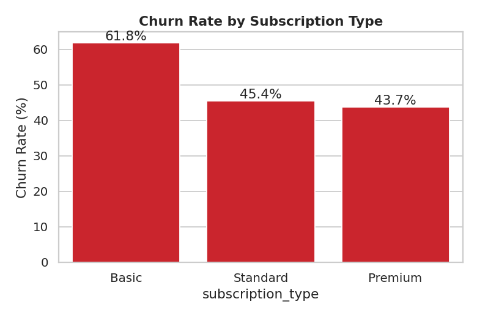
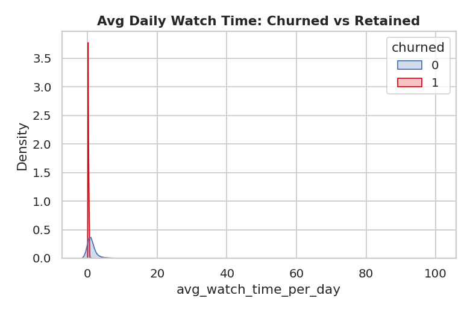
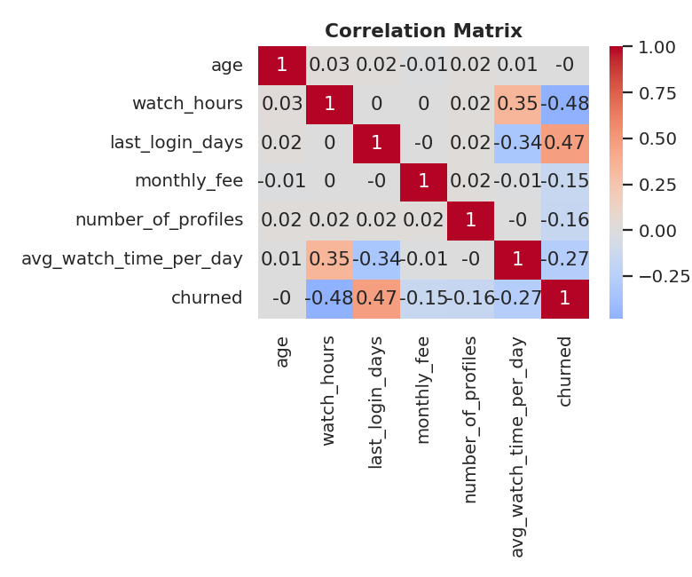
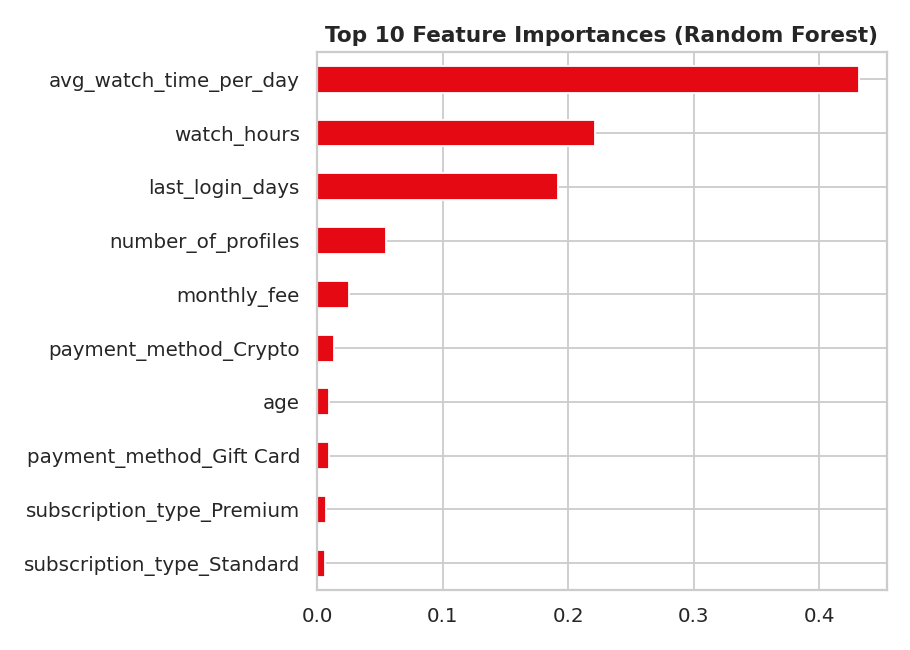
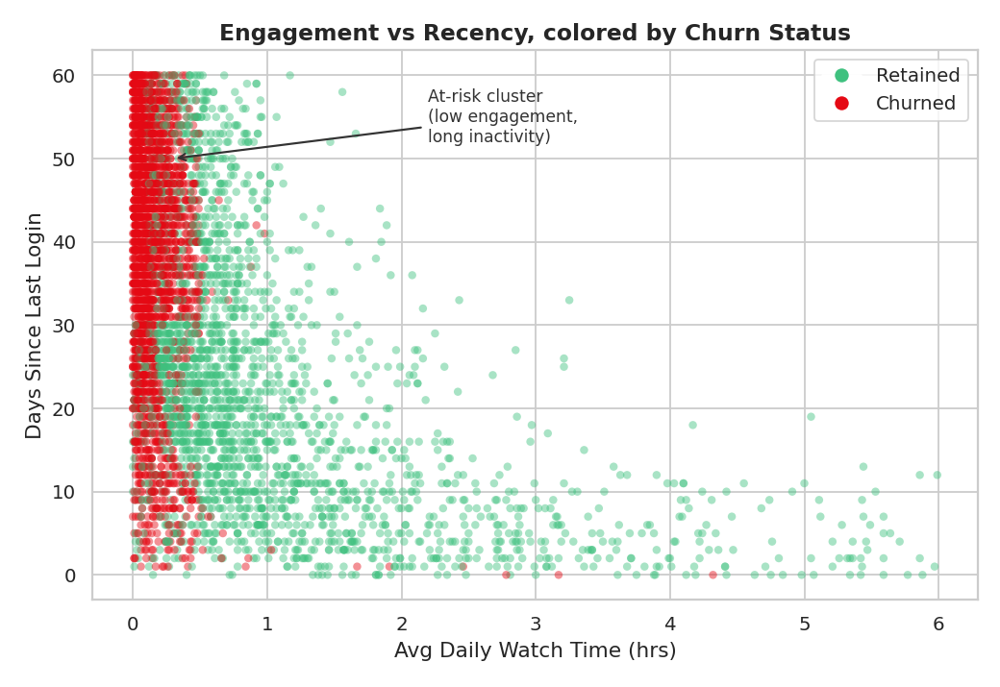
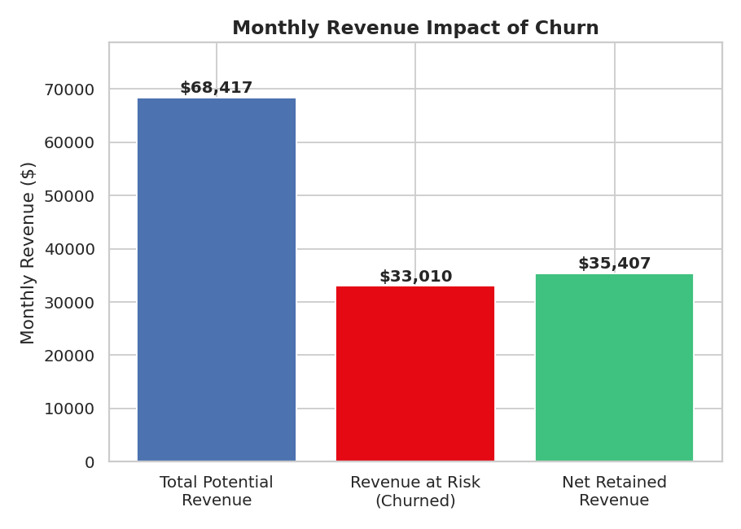
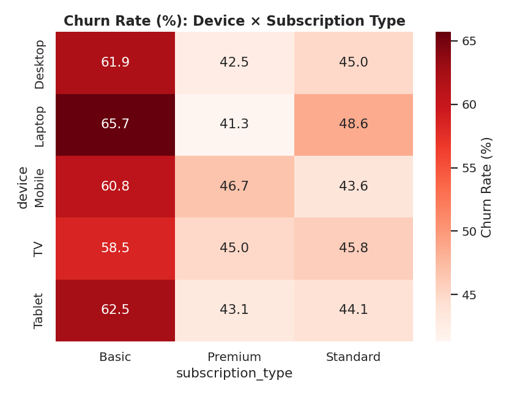
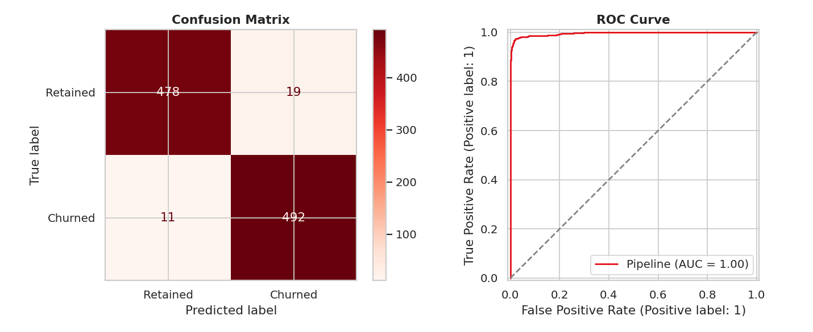
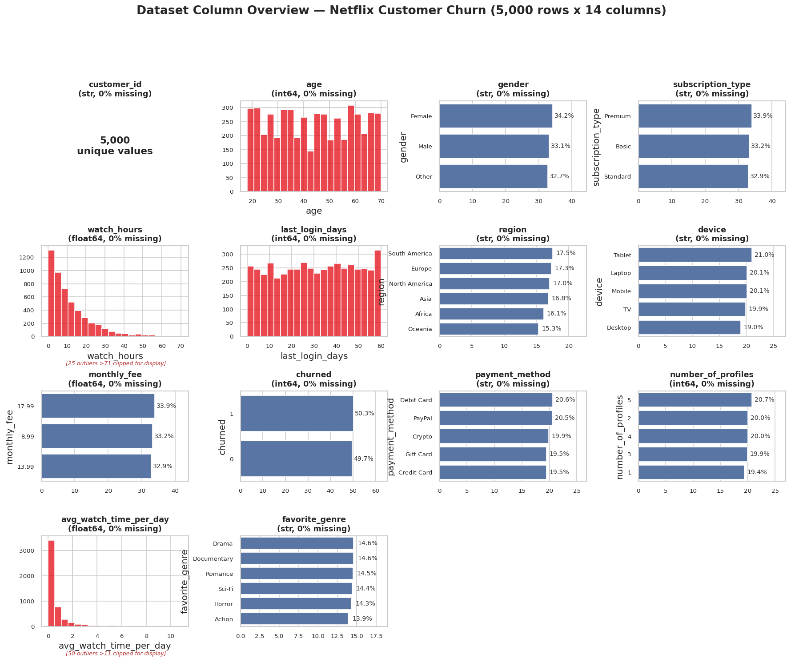

# 🎬 Netflix Customer Churn & Engagement Analytics


An end-to-end **exploratory data analysis + churn prediction** project on a Netflix-style
subscription dataset of 5,000 customers. The centerpiece is a structured **30-question
EDA notebook** that moves from data quality checks through demographic/behavioral churn
drivers, statistical hypothesis testing, and a Random Forest churn-prediction model
achieving **97% accuracy** and **0.996 ROC-AUC**.

> 📓 Inspired by the analytical structure of [Netflix Churn Analytics & 30 Questions EDA](https://www.kaggle.com/code/zeyadmohamed26/netflix-churn-analytics-30-questions-eda) on Kaggle, rebuilt from scratch as a modular, production-style project with reusable source code, statistical testing, and a full ML pipeline.

---

## 📊 Key Results

| Metric | Value |
|---|---|
| Overall churn rate | 50.3% |
| Model accuracy (Random Forest) | **97.0%** |
| ROC-AUC | **0.996** |
| Precision / Recall | 0.963 / 0.978 |
| Top churn driver | `avg_watch_time_per_day` (43% of feature importance) |

### Why These Results Are Trustworthy

The model was trained on **4,000 customers (80%)** and evaluated only on a
held-back set of **1,000 customers (20%)** that it never saw during training.
That separation means the reported accuracy and ROC-AUC measure how well the
model generalizes to unseen customers, rather than how well it memorized its
training data. The live demo's **100 real customers** are drawn from that
held-back evaluation set, so its predictions are a practical demonstration of
the same out-of-sample performance—not just memorized results.

**Headline insight:** Churn in this dataset is driven overwhelmingly by **behavioral
signals** — declining daily watch time, low total watch hours, and login recency —
not by demographics (age, gender, region). This means retention efforts targeted at
*engagement decay* will outperform broad demographic-based campaigns.

---

## 🖼️ Sample Visualizations

| Churn by Subscription Type | Engagement vs Churn |
|---|---|
|  |  |

| Correlation Matrix | Feature Importance |
|---|---|
|  |  |

| Engagement vs Recency (the key churn signal) |
|---|
|  |

| Revenue Impact | Device × Plan Heatmap |
|---|---|
|  |  |

| Model Performance (Confusion Matrix + ROC) |
|---|
|  |

| Full Column Profile (data quality audit) |
|---|
|  |

---

## 🩺 Data Quality — a real finding

Profiling every column (see [`reports/DATA_PROFILE.md`](reports/DATA_PROFILE.md)) surfaced
a genuine anomaly: **10 customers (0.2%)** have an `avg_watch_time_per_day` above 24 hours —
physically impossible — and every one of them also has `last_login_days` of 0 or 1. This is
the kind of check that separates "ran `.describe()` and moved on" from a validated analysis,
and it's documented with the investigation, root-cause hypothesis, and handling
recommendation for both the notebook and the BI dashboards.

---

## 📊 Business Intelligence: Power BI & Tableau

This project isn't just a notebook — it ships BI-ready deliverables so the same analysis
can live in a dashboard tool your stakeholders already use:

| | Power BI | Tableau |
|---|---|---|
| Data | [`powerbi/netflix_churn_powerbi.csv`](powerbi/netflix_churn_powerbi.csv) | [`tableau/netflix_churn_tableau.csv`](tableau/netflix_churn_tableau.csv) |
| Guide | [`powerbi/POWERBI_GUIDE.md`](powerbi/POWERBI_GUIDE.md) — DAX measures, dashboard layout, formatting | [`tableau/TABLEAU_GUIDE.md`](tableau/TABLEAU_GUIDE.md) — calculated fields, worksheet list, dashboard actions |

Both exports include the engineered fields (`age_group`, `engagement_level`,
`recency_flag`, `revenue_at_risk`, `annual_value`, `churn_status`) pre-computed, so you
can drop straight into building visuals without re-deriving anything in-tool.

---

## 🎮 Interactive Live Demo

[`demo/churn_predictor_demo.html`](demo/churn_predictor_demo.html) is a standalone,
zero-dependency page — open it directly in any browser (or host it via GitHub Pages).
It includes:

- **Real customer explorer** — browse 100 actual test-set customers, sort/filter/search,
  click any row for a full profile modal and a click-to-load into the builder
- **Hypothetical customer builder** — sliders + dropdowns feeding a live churn-probability
  gauge, computed with the *exact* trained logistic regression weights (verified against
  Python's `predict_proba()` to 15 decimal places, no server required)
- **Dataset-wide segment insights** and a two-customer comparison tool

---

```
netflix-churn-analytics/
├── README.md
├── requirements.txt
├── LICENSE
├── .gitignore
├── data/
│   └── netflix_customer_churn.csv       # 5,000 rows x 14 columns, no missing values
├── notebooks/
│   └── netflix_churn_30_questions_eda.ipynb   # main deliverable — 30 Q&A, fully executed
├── demo/
│   └── churn_predictor_demo.html   # standalone interactive demo, real model weights
├── src/
│   ├── data_loader.py      # load_data(), add_engineered_features()
│   ├── eda_utils.py        # churn_rate_by(), plotting helpers, t-test / chi-square
│   └── churn_model.py      # preprocessing pipeline, RF / LogReg training + evaluation
├── reports/
│   ├── DATA_PROFILE.md     # column-by-column data quality audit (with a real anomaly found)
│   └── figures/            # exported PNG charts (used in this README)
├── powerbi/
│   ├── netflix_churn_powerbi.csv   # BI-ready export with engineered fields
│   └── POWERBI_GUIDE.md           # DAX measures + dashboard layout
├── tableau/
│   ├── netflix_churn_tableau.csv  # BI-ready export with engineered fields
│   └── TABLEAU_GUIDE.md           # calculated fields + dashboard layout
└── models/                 # (optional) place to persist a trained model artifact
```

---

## 📁 Dataset

**Source:** [Netflix Customer Churn & Engagement Dataset](https://www.kaggle.com/datasets/dddtra/netflix-customer-churn-and-engagement-dataset) (Kaggle, synthetic)

| Column | Description |
|---|---|
| `customer_id` | Unique customer identifier (UUID) |
| `age` | Customer age |
| `gender` | Male / Female / Other |
| `subscription_type` | Basic / Standard / Premium |
| `watch_hours` | Total hours watched |
| `last_login_days` | Days since last login (recency) |
| `region` | Africa / Asia / Europe / North America / South America / Oceania |
| `device` | TV / Mobile / Laptop / Desktop / Tablet |
| `monthly_fee` | Monthly subscription fee ($) |
| `churned` | Target variable — 1 = churned, 0 = retained |
| `payment_method` | Credit Card / Debit Card / PayPal / Crypto / Gift Card |
| `number_of_profiles` | Number of profiles on the account |
| `avg_watch_time_per_day` | Average daily watch time (hours) |
| `favorite_genre` | Action / Comedy / Documentary / Drama / Horror / Romance / Sci-Fi |

5,000 rows, 14 columns, **zero missing values, zero duplicates**.

---

## ❓ The 30 Questions

<details>
<summary><b>Click to expand full question list</b></summary>

**Section 1 — Setup & Data Overview**
1. What is the shape and structure of the dataset?
2. Are there any missing values or duplicate records?
3. What is the overall churn rate?

**Section 2 — Demographics & Churn**
4. What is the age distribution, and does churn vary by age group?
5. How does gender relate to churn rate?
6. Which regions have the highest and lowest churn rates?

**Section 3 — Subscription & Revenue**
7. What is the churn rate by subscription type?
8. How does monthly fee correlate with churn?
9. What is the estimated monthly revenue lost due to churn?
10. Which payment methods are associated with higher churn?

**Section 4 — Engagement Behavior**
11. How do watch hours differ between churned and retained customers?
12. What is the relationship between average daily watch time and churn?
13. How does login recency impact churn probability?
14. Is there a correlation between number of profiles and churn?
15. Which devices are most associated with churn?
16. What are the most popular genres, and do genre preferences affect churn?

**Section 5 — Segmentation & Cross-Analysis**
17. What is the churn rate across device × subscription-type combinations?
18. Does age group × subscription type reveal a distinct pattern?
19. How does region × subscription type affect churn?
20. Is there a distinct "high-risk" customer profile?

**Section 6 — Statistical Hypothesis Testing**
21. Is the difference in watch hours between churned/retained customers statistically significant? (Welch's t-test)
22. Is subscription type independent of churn status? (Chi-square test)
23. Is region independent of churn? (Chi-square test)
24. Which numeric variables show the strongest correlation with churn?

**Section 7 — Predictive Modeling**
25. Can we build a model to predict churn based on customer attributes?
26. Which features are most important in predicting churn?
27. What is the final model's detailed performance (confusion matrix, ROC-AUC)?
28. What actionable customer segments emerge from the model's predicted churn probabilities?

**Section 8 — Business Recommendations**
29. What retention strategies would reduce churn based on these findings?
30. What is the estimated revenue impact of a hypothetical retention campaign?

</details>

---

## 🚀 Getting Started

### 1. Clone and install dependencies
```bash
git clone https://github.com/<your-username>/netflix-churn-analytics.git
cd netflix-churn-analytics
pip install -r requirements.txt
```

### 2. Run the notebook
```bash
jupyter notebook notebooks/netflix_churn_30_questions_eda.ipynb
```
The notebook is already fully executed with saved outputs — you can view it directly on
GitHub without running anything, or re-run it end-to-end to reproduce every result.

### 3. Or use the modules directly
```python
from src.data_loader import load_data, add_engineered_features
from src.churn_model import get_train_test_split, train_random_forest, evaluate_model

df = add_engineered_features(load_data("data/netflix_customer_churn.csv"))
X_train, X_test, y_train, y_test = get_train_test_split(df)

model = train_random_forest(X_train, y_train)
print(evaluate_model(model, X_test, y_test))
```

---

## 🧠 Methodology

1. **Data validation** — schema check, null/duplicate audit.
2. **Feature engineering** — age bands, tertile-based engagement levels, a recency-risk
   flag, and a revenue-at-risk column (see `src/data_loader.py`).
3. **Univariate & bivariate EDA** — distribution plots and churn-rate breakdowns across
   every categorical and numeric feature.
4. **Cross-segmentation** — two-way pivot heatmaps (e.g. device × subscription tier) to
   surface interaction effects invisible in single-variable views.
5. **Statistical testing** — Welch's t-tests for numeric features, chi-square tests of
   independence for categorical features, both at α = 0.05.
6. **Modeling** — a `ColumnTransformer` + `Pipeline` (scaling numeric features,
   one-hot encoding categoricals) feeding both a Logistic Regression baseline and a
   tuned Random Forest, evaluated on accuracy, precision, recall, F1, and ROC-AUC.
7. **Business translation** — model outputs converted into three actionable risk tiers
   (Low / Medium / High) with an estimated revenue-recovery scenario for a hypothetical
   retention campaign.

---

## 🛠️ Tech Stack

- **Python 3.10+**
- `pandas`, `numpy` — data manipulation
- `matplotlib`, `seaborn` — visualization
- `scipy` — hypothesis testing
- `scikit-learn` — preprocessing pipelines, Logistic Regression, Random Forest, metrics

---

## 📄 License

This project is licensed under the MIT License — see [LICENSE](LICENSE) for details.
The dataset is synthetic and publicly available on Kaggle for educational use.

---

## 🙋 Acknowledgements

- Dataset: [Netflix Customer Churn & Engagement Dataset](https://www.kaggle.com/datasets/dddtra/netflix-customer-churn-and-engagement-dataset) on Kaggle
- Analytical structure inspired by [Netflix Churn Analytics & 30 Questions EDA](https://www.kaggle.com/code/zeyadmohamed26/netflix-churn-analytics-30-questions-eda)
